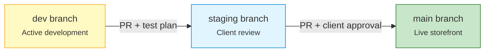
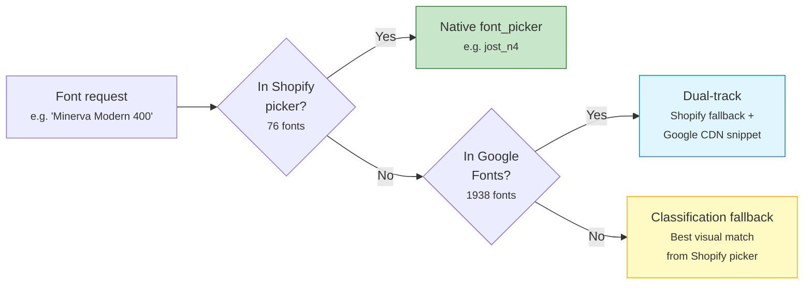
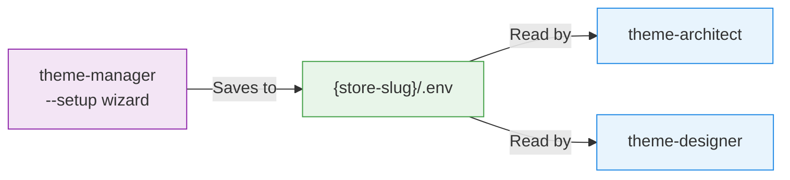

# Architecture Diagram

## Platform Overview

```mermaid
graph TB
    %% ── External Services ──────────────────────────────────
    subgraph External["External Services"]
        Figma["Figma<br/><small>Design files & tokens</small>"]
        Shopify["Shopify Admin API<br/><small>Themes & storefront</small>"]
        GitHub["GitHub<br/><small>rinaldoevosem/*</small>"]
        GoogleFonts["Google Fonts<br/><small>~1938 fonts</small>"]
    end

    %% ── Orchestration Layer ────────────────────────────────
    subgraph Paperclip["Paperclip  —  Task Orchestration  (localhost:3100)"]
        PaperclipAPI["REST API<br/><small>Tasks / heartbeats / cost tracking</small>"]
    end

    %% ── Theme Manager ──────────────────────────────────────
    subgraph TM["Theme Manager<br/><small>Version control & coordination</small><br/><small>Heartbeat 4h  |  Sonnet  |  $50/mo</small>"]
        TM_Main["main.py<br/><small>--heartbeat | --setup | prompt</small>"]
        subgraph TM_Tools["MCP Tools"]
            TM_T1["get_theme_status"]
            TM_T2["check_promotion_readiness"]
            TM_T3["generate_change_summary"]
        end
        subgraph TM_Subs["Sub-Agents"]
            TM_Sub1["sync-checker<br/><small>Drift detection</small>"]
            TM_Sub2["pr-reviewer<br/><small>PR workflow</small>"]
            TM_Sub3["stakeholder-reporter<br/><small>Reports</small>"]
        end
        TM_Setup["setup_server.py<br/><small>Browser wizard</small>"]
    end

    %% ── Theme Architect ────────────────────────────────────
    subgraph TA["Theme Architect<br/><small>Read-only design-to-section matcher</small><br/><small>Heartbeat 6h  |  Sonnet (configurable)  |  $30/mo</small>"]
        TA_Main["main.py<br/><small>--heartbeat | --model | prompt</small>"]
        subgraph TA_Tools["MCP Tools"]
            TA_T1["analyze_theme_architecture"]
            TA_T2["get_section_details"]
            TA_T3["match_section_to_design"]
        end
        subgraph TA_Subs["Sub-Agents"]
            TA_Sub1["section-analyzer<br/><small>Schema & Liquid analysis</small>"]
            TA_Sub2["design-interpreter<br/><small>Figma requirements</small>"]
        end
    end

    %% ── Theme Designer ─────────────────────────────────────
    subgraph TD["Theme Designer<br/><small>Figma design tokens to settings_data.json</small><br/><small>Heartbeat 6h  |  Sonnet (configurable)  |  $40/mo</small>"]
        TD_Main["main.py<br/><small>--heartbeat | --dry-run | --model | prompt</small>"]
        subgraph TD_Tools["MCP Tools"]
            TD_T1["parse_settings_schema"]
            TD_T2["resolve_font<br/><small>3-tier resolution</small>"]
            TD_T3["validate_setting_value"]
            TD_T4["apply_design_tokens"]
            TD_T5["inject_external_fonts"]
            TD_T6["get_shopify_fonts"]
        end
        subgraph TD_Subs["Sub-Agents"]
            TD_Sub1["figma-interpreter<br/><small>Design token extraction</small>"]
            TD_Sub2["typography-handler<br/><small>Font & scale mapping</small>"]
        end
    end

    %% ── Eval Runner ────────────────────────────────────────
    subgraph ER["Eval Runner<br/><small>Deterministic Python test harness</small><br/><small>Manual trigger  |  No LLM  |  $0 runtime</small>"]
        ER_Main["main.py<br/><small>--overnight | --score | --report</small>"]
        ER_Scorer["scorer.py<br/><small>Accuracy 40% | Reasoning 25%<br/>Completeness 15% | Cost 10% | Speed 10%</small>"]
        ER_Cases["eval_cases/<br/><small>9 YAML suites, 40 cases</small>"]
    end

    %% ── Per-Store Data ─────────────────────────────────────
    subgraph Store["Per-Store Project  (e.g. horizon-clone/)"]
        StoreEnv[".env<br/><small>Shopify + GitHub + Paperclip creds</small>"]
        StoreRepo["repo-main/<br/><small>sections / blocks / snippets<br/>config / templates / layout</small>"]
    end

    %% ── Connections: Agents to Paperclip ───────────────────
    TM_Main <--->|"Tasks & heartbeats"| PaperclipAPI
    TA_Main <--->|"Tasks & heartbeats"| PaperclipAPI
    TD_Main <--->|"Tasks & heartbeats"| PaperclipAPI
    ER_Main <--->|"Create tasks & poll"| PaperclipAPI

    %% ── Connections: Agents to External Services ───────────
    TM_Main <--->|"PRs, branches, commits"| GitHub
    TM_Main <--->|"theme pull/push"| Shopify

    TA_Sub2 --->|"get_design_context<br/>get_screenshot"| Figma
    TD_Sub1 --->|"get_design_context<br/>get_screenshot<br/>get_metadata"| Figma

    TD_T2 --->|"Font lookup"| GoogleFonts
    TD_T5 --->|"CDN link generation"| GoogleFonts

    %% ── Connections: Inter-agent ───────────────────────────
    ER_Main -->|"Triggers heartbeat<br/>via Paperclip tasks"| TA_Main
    TM_Setup -->|"Creates .env"| StoreEnv

    %% ── Connections: Agents to Store Data ──────────────────
    TM_Main --->|"Reads & writes"| StoreRepo
    TA_Main --->|"Reads only"| StoreRepo
    TD_Main --->|"Writes settings_data.json"| StoreRepo

    TA_Main -.->|"Reads creds"| StoreEnv
    TD_Main -.->|"Reads creds"| StoreEnv
    TM_Main -.->|"Creates & reads"| StoreEnv

    %% ── Styling ────────────────────────────────────────────
    classDef agent fill:#e8f4fd,stroke:#1e88e5,stroke-width:2px
    classDef external fill:#fff3e0,stroke:#fb8c00,stroke-width:2px
    classDef infra fill:#f3e5f5,stroke:#8e24aa,stroke-width:2px
    classDef data fill:#e8f5e9,stroke:#43a047,stroke-width:2px
    classDef evalNode fill:#fce4ec,stroke:#e53935,stroke-width:2px

    class TM,TA,TD agent
    class ER evalNode
    class External,Figma,Shopify,GitHub,GoogleFonts external
    class Paperclip,PaperclipAPI infra
    class Store,StoreEnv,StoreRepo data
```

## Agent Metrics

| Agent | Model | Heartbeat | Budget | Runtime | Permissions |
|-------|-------|-----------|--------|---------|-------------|
| [[agents/theme-manager\|Theme Manager]] | Sonnet (default) | Every 4h | $50/mo | claude-agent-sdk, python-dotenv | Read + Write + Bash |
| [[agents/theme-architect\|Theme Architect]] | Sonnet (configurable) | Every 6h | $30/mo | claude-agent-sdk, python-dotenv | Read-only |
| [[agents/theme-designer\|Theme Designer]] | Sonnet (configurable) | Every 6h | $40/mo | claude-agent-sdk, python-dotenv | Read + Write (settings only) |
| [[agents/eval-runner\|Eval Runner]] | None (plain Python) | Manual | $0 | httpx, pyyaml, python-dotenv | N/A |

## Theme Promotion Flow

> [!info] Single Repo, Three Branches
> All environments share one GitHub repository (`rinaldoevosem/horizon-clone`). Each branch maps to a Shopify theme. The [[agents/theme-manager|Theme Manager]] enforces the promotion workflow via PR reviews.

## Font Resolution Flow

> [!tip] Dual-Track Strategy
> When a font is on Google Fonts but not in Shopify's picker, the [[agents/theme-designer|Theme Designer]] sets a Shopify fallback for the `font_picker` setting AND creates Liquid snippets that load the real font via Google Fonts CDN. See [[infrastructure/font-pipeline|Font Pipeline]] for details.

## Credential Flow

