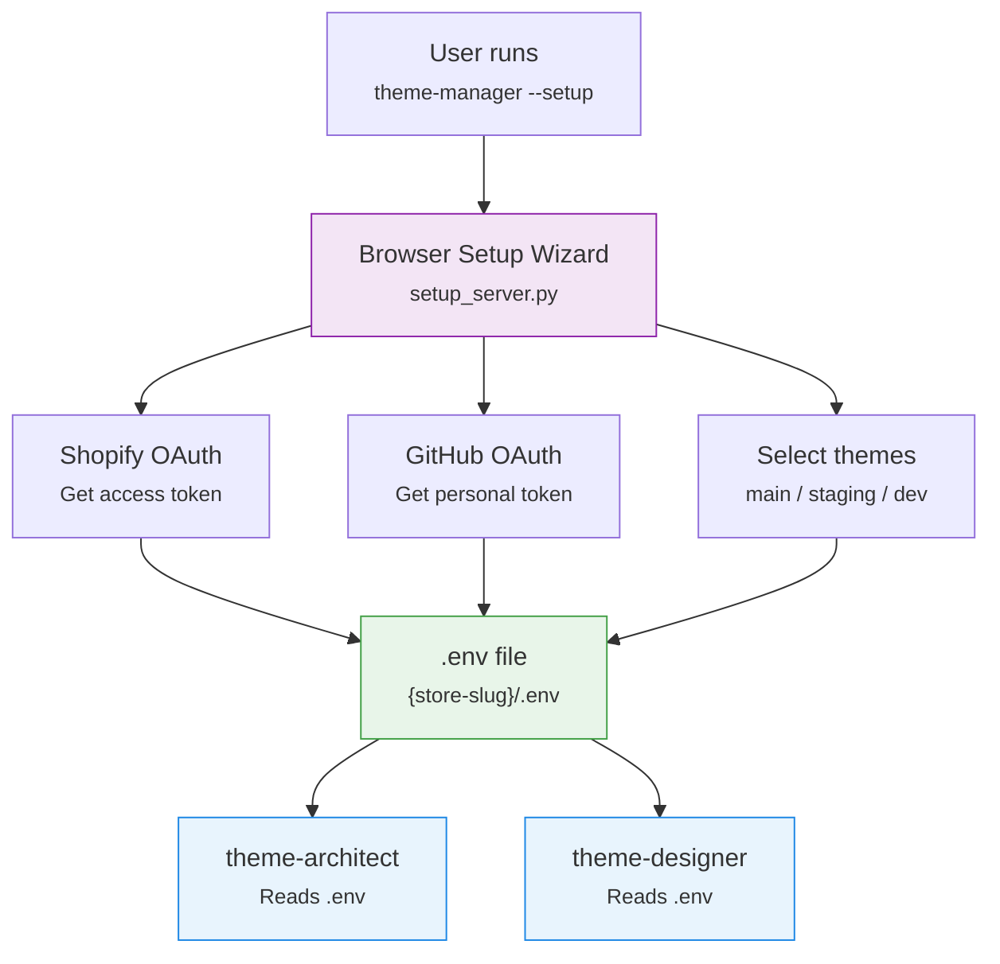

# Credentials & Setup

> [!info] All agents share a per-store credential model. The [[agents/theme-manager|Theme Manager]] creates `.env` files via its setup wizard, which the other agents consume.

## Per-Store Project Structure

Each Shopify store gets its own project directory:

```
/Users/melo/shopify-theme/{store-slug}/
├── .env                    # Credentials (gitignored)
├── repo-main/              # Pulled Shopify theme
│   ├── sections/           # 39 main sections
│   ├── blocks/             # 93 reusable blocks
│   ├── snippets/           # 103 Liquid partials
│   ├── templates/          # JSON page templates
│   ├── config/             # settings_schema.json, settings_data.json
│   ├── layout/             # theme.liquid wrapper
│   ├── assets/             # CSS, JS, images
│   └── locales/            # Translation files
└── design-analyzer/        # Optional: Node.js Figma analyzer
```

The `store-slug` is derived from the Shopify domain: `horizon-clone.myshopify.com` -> `horizon-clone`.

## Credential Flow



## Setup Wizard

The Theme Manager's setup wizard (`setup_server.py`) launches a local HTTP server:

```bash
# General setup
cd agents/theme-manager
python main.py --setup

# Pre-fill store domain
python main.py --setup --store-domain horizon-clone.myshopify.com
```

### What it does:

1. Opens a browser to the setup UI
2. User authenticates with Shopify (OAuth) -> gets `SHOPIFY_ACCESS_TOKEN`
3. User authenticates with GitHub (OAuth) -> gets `GITHUB_TOKEN`
4. User selects a GitHub repo for the theme
5. User picks Shopify themes for main/staging/dev environments
6. Saves everything to `{store-slug}/.env`

## Agent Credential Requirements

| Agent | Needs .env? | Creates .env? | Which credentials? |
|-------|-------------|---------------|-------------------|
| [[agents/theme-manager\|Theme Manager]] | Yes (or creates via wizard) | Yes | All Shopify + GitHub + theme IDs |
| [[agents/theme-architect\|Theme Architect]] | Yes | No | Shopify domain + token, GitHub token |
| [[agents/theme-designer\|Theme Designer]] | Yes | No | Shopify domain + token, GitHub token |
| [[agents/eval-runner\|Eval Runner]] | Own `.env` | No | Paperclip + architect references only |

## Credential Check Priority

All 3 LLM agents follow the same first-priority pattern:

1. **Check `.env` exists** for the target store
2. **Validate credentials** are real (not placeholders like `dry-run-token`)
3. **If missing**: Theme Manager launches setup wizard; Architect and Designer mark the task as `blocked` and direct the user to run Theme Manager setup

> [!warning] No Setup Wizard in Architect/Designer
> Only the Theme Manager has a setup wizard. If the architect or designer encounters missing credentials, it cannot create them — it must ask the user to run `cd ../theme-manager && python main.py --setup --store-domain <domain>`.

## Claude Authentication

The platform authenticates with Claude via CLI subscription — not API keys:

- No `ANTHROPIC_API_KEY` needed
- Authentication handled by the Claude CLI session
- Agent SDK inherits the CLI's auth context

See [[reference/env-variables]] for the complete environment variable reference.
