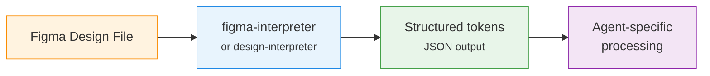

# Figma Integration

> [!info] Two agents read Figma designs via the Figma MCP plugin: the [[agents/theme-architect|Theme Architect]] (for structural analysis) and the [[agents/theme-designer|Theme Designer]] (for design token extraction).

## Figma MCP Tools

| Tool | Used By | Purpose |
|------|---------|---------|
| `get_design_context` | Architect, Designer | Read design file structure, styles, and components from a Figma URL |
| `get_screenshot` | Architect, Designer | Get a visual rendering of a Figma frame or page |
| `get_metadata` | Designer | Get detailed style information — colors, fonts, effects |

### Tool Name Prefix

In the Agent SDK, Figma tools are referenced as:
```
mcp__plugin_figma_figma__get_design_context
mcp__plugin_figma_figma__get_screenshot
mcp__plugin_figma_figma__get_metadata
```

## How Each Agent Uses Figma

### Theme Architect — Structural Analysis

The architect's **design-interpreter** sub-agent reads Figma to extract *structural* requirements:

- Layout type (full-width, grid, split)
- Block types needed (heading, image, button, text)
- Settings requirements (color scheme, spacing, border radius)
- Interactive elements (sliders, tabs, accordions)

This is used by `match_section_to_design` to score existing theme sections against the design.

### Theme Designer — Token Extraction

The designer's **figma-interpreter** sub-agent reads Figma to extract *visual* tokens:

- **Fonts**: Family names, weights, italic flags for body/heading/accent roles
- **Colors**: Background, foreground, primary, hover states, button colors, input colors
- **Typography scale**: H1-H6 sizes (px), line heights, letter spacing, text transforms
- **Buttons**: Border widths, border radii for primary and secondary
- **Spacing**: Page width preference (narrow/normal/wide)

Output is a structured JSON object that feeds into the typography-handler and color mapping logic.

## Authentication

Figma MCP uses the `figma` plugin from `claude-plugins-official`. Authentication is handled at the Claude CLI level (plugin OAuth), not per-agent.

> [!warning] Agent SDK Limitation
> Figma MCP tools are only available when running through the Claude CLI session, not when the Agent SDK runs as a subprocess. For automated heartbeat runs, Figma designs must be pre-processed or the task description must include extracted tokens.

## Figma URL Extraction

Both architect and designer extract Figma URLs from Paperclip task metadata:

```python
# Regex pattern used by both agents
_FIGMA_RE = re.compile(r"https?://(?:www\.)?figma\.com/[\w/\-?=&]+")

# Checks task.metadata.figma_url first, then searches title + description
```

## Workflow Position


