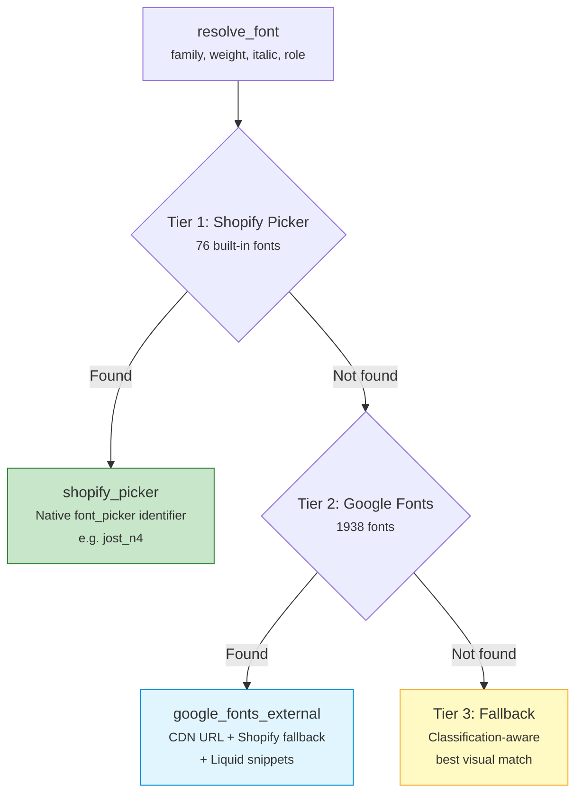

# Font Pipeline

> [!info] The [[agents/theme-designer|Theme Designer]] uses a 3-tier font resolution system to map design fonts to Shopify theme settings. When a font isn't natively available, it loads via Google Fonts CDN and overrides CSS custom properties.

## 3-Tier Resolution



### Tier 1: Shopify Picker (76 fonts)

Shopify's `font_picker` setting type only accepts identifiers from their built-in library. Format: `{family_slug}_{style}{weight_digit}`.

| Example | Meaning |
|---------|---------|
| `jost_n4` | Jost, normal weight 400 |
| `playfair_display_n7` | Playfair Display, normal weight 700 |
| `inter_i4` | Inter, italic weight 400 |

### Tier 2: Google Fonts External (1938 fonts)

When a font is on Google Fonts but NOT in Shopify's picker, the agent uses a **dual-track strategy**:

1. **`font_picker` setting** -> Set to the best Shopify fallback (required by Shopify)
2. **Liquid snippets** -> Load the real font via Google Fonts CDN and override CSS variables

### Tier 3: Classification-Aware Fallback

When a font isn't on Google Fonts or Shopify, the system finds the best visual match from Shopify's picker using font classification:

| Classification | Example Fonts |
|---------------|---------------|
| `geometric_sans` | Jost, Poppins, Nunito Sans |
| `humanist_sans` | Open Sans, Lato, Karla |
| `neo_grotesque` | Inter, Roboto, Libre Franklin |
| `serif_transitional` | Libre Baskerville, Bitter |
| `serif_old_style` | Cormorant, EB Garamond |
| `serif_display` | Playfair Display, DM Serif Text |
| `serif_slab` | Josefin Slab |
| `monospace` | IBM Plex Mono, Source Code Pro |
| `display_condensed` | Oswald, Bebas Neue, Anton |

## Dual-Track External Font Strategy

When a font is resolved as `google_fonts_external`, the [[agents/theme-designer|Theme Designer]] creates two Liquid snippets:

### `snippets/custom-fonts.liquid`

Loaded **BEFORE** `fonts.liquid` (preload position):

```liquid
 External fonts loaded by Theme Designer 
<link rel="preconnect" href="https://fonts.googleapis.com">
<link rel="preconnect" href="https://fonts.gstatic.com" crossorigin>
<link rel="stylesheet" href="https://fonts.googleapis.com/css2?family=...&display=swap">
```

### `snippets/custom-fonts-overrides.liquid`

Loaded **AFTER** `theme-styles-variables.liquid` (override position):

```liquid

  :root {
    --font-heading--family: "Real Font", "Shopify Fallback", serif;
  }

```

### Layout Injection Points

The `inject_external_fonts` tool modifies layout files to include the snippets:

| Layout File | Snippet | Position |
|-------------|---------|----------|
| `layout/theme.liquid` | `custom-fonts` | BEFORE `` |
| `layout/theme.liquid` | `custom-fonts-overrides` | AFTER `` |
| `layout/password.liquid` | Same positions | Same logic |
| `templates/gift_card.liquid` | Same positions | Same logic |

## Shopify Theme Font Pipeline

Understanding the injection order:

```
1. custom-fonts.liquid        ← Google Fonts <link> tags (PRELOAD)
2. fonts.liquid               ← Shopify built-in font preloading
3. theme-styles-variables.liquid  ← @font-face + CSS custom properties
4. custom-fonts-overrides.liquid  ← Override --font-heading--family etc.
5. base.css                   ← Applies via var(--font-heading--family)
```

## Font Role Mapping

The theme has four font slots:

| Slot | Setting ID | CSS Variable | Used For |
|------|-----------|--------------|----------|
| Body | `type_body_font` | `--font-body--family` | Paragraph / body text |
| Heading | `type_heading_font` | `--font-heading--family` | H1-H4 (when `type_font_hN = "heading"`) |
| Subheading | `type_subheading_font` | `--font-subheading--family` | H5-H6 |
| Accent | `type_accent_font` | `--font-accent--family` | Display text (when `type_font_hN = "accent"`) |

## Google Fonts Dataset

| Property | Value |
|----------|-------|
| **File** | `agents/theme-designer/data/google_fonts.json` |
| **Size** | 763 KB |
| **Font Count** | 1938 |
| **Source** | google-webfonts-helper API (free, no key required) |
| **Refresh** | Quarterly via `scripts/fetch_google_fonts.py` |
| **Fields per font** | family, slug, category, variants, has_italic, classification, in_shopify_picker, css_url |

> [!tip] Refresh Command
> ```bash
> cd agents/theme-designer
> source .venv/bin/activate
> python scripts/fetch_google_fonts.py
> ```
