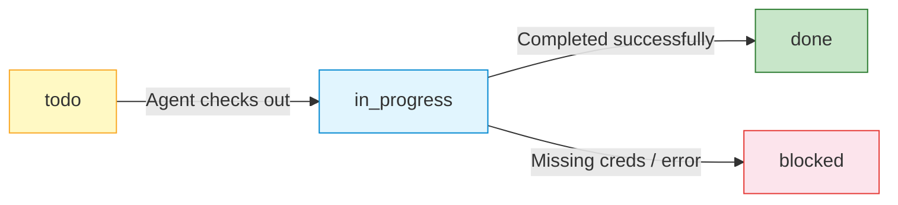

# Paperclip — Task Orchestration

> [!info] Paperclip is the central task orchestration layer that assigns work to agents, tracks heartbeats, and records cost metrics. All 3 LLM agents and the eval runner communicate through it.

## Connection

| Property | Value |
|----------|-------|
| **API URL** | `http://localhost:3100` |
| **Auth** | None (local development) |
| **Protocol** | REST (JSON) |

## Task Lifecycle



### Heartbeat Flow

Each LLM agent runs on a cron schedule:

1. **Wake up** on schedule (e.g. every 4h for Theme Manager)
2. **Fetch assigned tasks** — `GET /api/companies/{id}/agents/{id}/tasks`
3. **Filter** to `status == "todo"` tasks
4. **For each task:**
   a. **Checkout** — `POST /api/tasks/{id}/checkout`
   b. **Update status** — `PATCH /api/tasks/{id}` → `in_progress`
   c. **Run the agent** against the task prompt
   d. **Post comment** — `POST /api/tasks/{id}/comments`
   e. **Update status** — `PATCH /api/tasks/{id}` → `done` or `blocked`
5. **If no tasks**, run a default health check prompt
6. **Write output** to local `heartbeat_output.json`

## Heartbeat Schedules

| Agent | Cron | Frequency | Default Action (no tasks) |
|-------|------|-----------|---------------------------|
| [[agents/theme-manager\|Theme Manager]] | `0 */4 * * *` | Every 4h | Sync check + PR review + drift detection |
| [[agents/theme-architect\|Theme Architect]] | `0 */6 * * *` | Every 6h | Theme architecture health check |
| [[agents/theme-designer\|Theme Designer]] | `0 */6 * * *` | Every 6h | Theme settings health check |

## API Routes

> [!warning] Path Inconsistency
> Some routes use `/api/companies/{id}/agents/{id}/tasks` while others use `/api/tasks/{id}`. The Paperclip client handles this internally.

### Key Endpoints

| Method | Path | Description |
|--------|------|-------------|
| `GET` | `/api/companies/{cid}/agents/{aid}/tasks` | Fetch tasks assigned to an agent |
| `POST` | `/api/tasks/{id}/checkout` | Check out a task (claim it) |
| `PATCH` | `/api/tasks/{id}` | Update task status / metadata |
| `POST` | `/api/tasks/{id}/comments` | Post a comment on a task |
| `POST` | `/api/companies/{cid}/tasks` | Create a new task (used by eval-runner) |
| `DELETE` | `/api/tasks/{id}` | Delete a task (used by eval-runner cleanup) |

## PaperclipClient

All 3 LLM agents share the same `PaperclipClient` class (copied into each agent directory):

```python
class PaperclipClient:
    def __init__(self, api_url, api_key, company_id, agent_id):
        ...

    async def fetch_assigned_tasks(self) -> list[dict]
    async def checkout_task(self, task_id: str)
    async def update_task_status(self, task_id: str, status: str)
    async def post_comment(self, task_id: str, comment: str)
    async def close(self)
```

## Agent Registration

Each agent has a `paperclip_agent.json` file with metadata:

```json
{
  "name": "Theme Manager",
  "id": "theme-manager",
  "description": "...",
  "role": "Theme Operations Manager",
  "capabilities": ["..."],
  "heartbeat": {
    "command": "python main.py --heartbeat",
    "schedule": "0 */4 * * *"
  },
  "commands": { "...": "..." },
  "budget": { "monthly_limit_usd": 50 }
}
```

## Budget Tracking

| Agent | Monthly Limit | Alert Threshold |
|-------|---------------|-----------------|
| Theme Manager | $50 | 80% ($40) |
| Theme Architect | $30 | 80% ($24) |
| Theme Designer | $40 | 80% ($32) |
| Eval Runner | $0 | N/A (cost charged to architect) |
